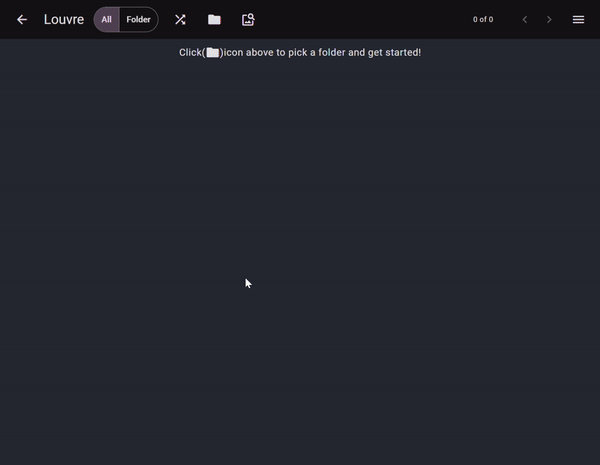
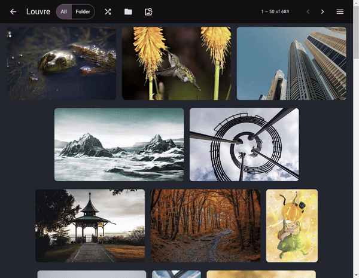
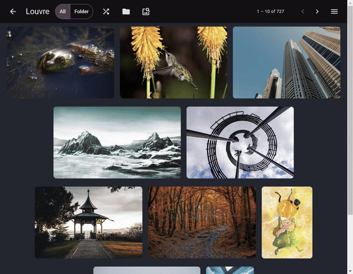

# Louvre

Offline photo/video viewer with the ability to shuffle.

## Features

- Completely offline, no server needed
- No ads, no install (portable), and its free
- Shuffle!
- Parse nested folders, and show images inside each folder
- Pageless scrolling
- Show image on computer
- No unknown third party scripts, only first party Angular + PWA File System Access API
- Supports: jpg, png, mp4, gif, and more
- Detect faces and search for people
- Migrate and organize folders

## Feature showcase

### Display all images in nested folders

### Preview folder images

### Shuffle images shuffle folders

### Pageless / infinite scrolling or paged

### Video playback support

### Image preview

#### And much more

## Installation instruction

You can access the hosted version of the app at [https://louvre-f710a.web.app](https://louvre-f710a.web.app).
It can also be installed as a web app using Chrome's app install feature. (Tested for Chrome).

## Developers note

- npm run for list of commands
- npm make to build
