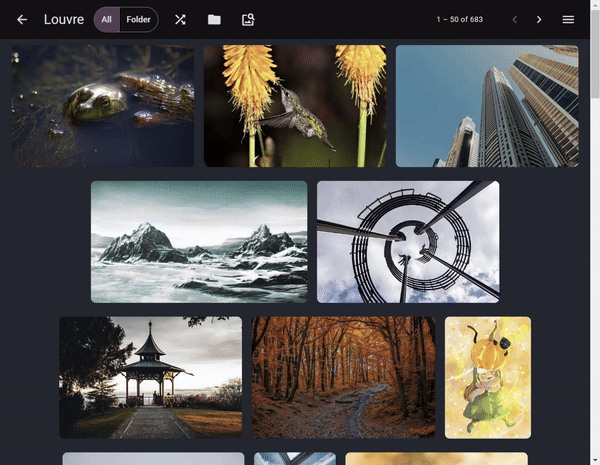

# Louvre

Offline photo/video viewer with the ability to shuffle.

## Features

- Completely offline, no server needed
- No ads, no install (portable), and its free
- Shuffle!
- Parse nested folders, and show images inside each folder
- Pageless scrolling
- Show image on computer
- No unknown third party scripts, only first party Angular + PWA File System Access API
- Supports: jpg, png, mp4, gif, and more

## Feature showcase

### Display all images in nested folders

### Preview folder images

### Shuffle images shuffle folders

### Pageless / infinite scrolling or paged

### Video playback support

### Image preview

#### And much more

## Installation instruction

1. Grab it from [Release](https://github.com/jerryliuoft/louvre/releases)
2. Run with administrator mode if normal mode doesn't work

For mac users:

Let me know if you want this, or just run the package command yourself below

## Developers note

- npm run for list of commands
- npm make to build
